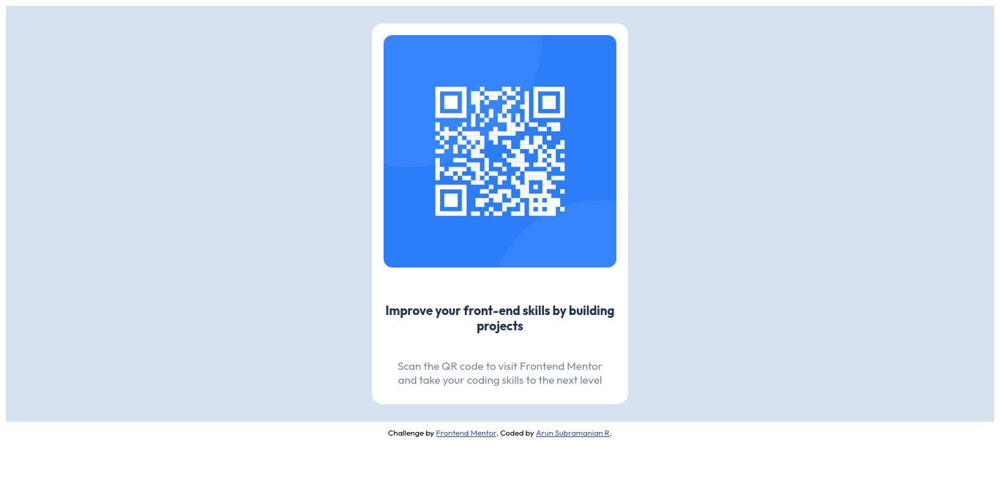

# Frontend Mentor - QR code component solution

This is a solution to the [QR code component challenge on Frontend Mentor](https://www.frontendmentor.io/challenges/qr-code-component-iux_sIO_H). Frontend Mentor challenges help you improve your coding skills by building realistic projects. 

## Table of contents

- [Overview](#overview)
  - [Screenshot](#screenshot)
  - [Links](#links)
- [My process](#my-process)
  - [Built with](#built-with)
  - [What I learned](#what-i-learned)
  - [Continued development](#continued-development)
- [Author](#author)

## Overview

### Screenshot

#### Desktop

#### Mobile

### Links

- Solution URL: [Github](https://github.com/arunsubaroo/frontend-mentor-qr-code-component-main)
- Live Site URL: [Pages](https://your-live-site-url.com)

## My process

### Built with

- Semantic HTML5 markup
- CSS custom properties
- Flexbox

### What I learned
This was an exercise in flexbox centring and responsive design and exposed to me where my skills where lacking in these subjects and also gave me ideas on how to improve on them. Despite being able to do it at work on an existing code base I was unable to do it from scratch on new project here and having discovered that I have been able to practice and rectify that flaw in my ability to work with CSS. 

### Continued development

I see a few things I would like to do taking this forward.
- [ ] build an actual QR Code viewer for any URL entered.
- [ ] make this more responsive and cleaner

## Author

- Frontend Mentor - [@arunsubaroo](https://www.frontendmentor.io/profile/arunsubaroo)